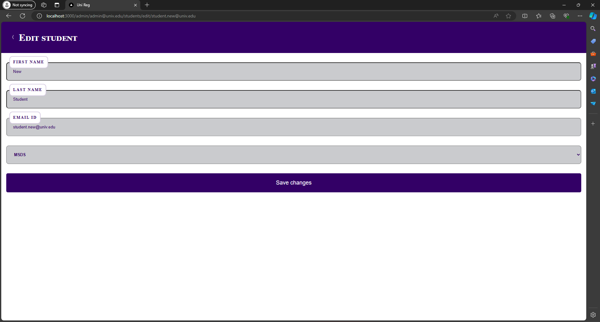
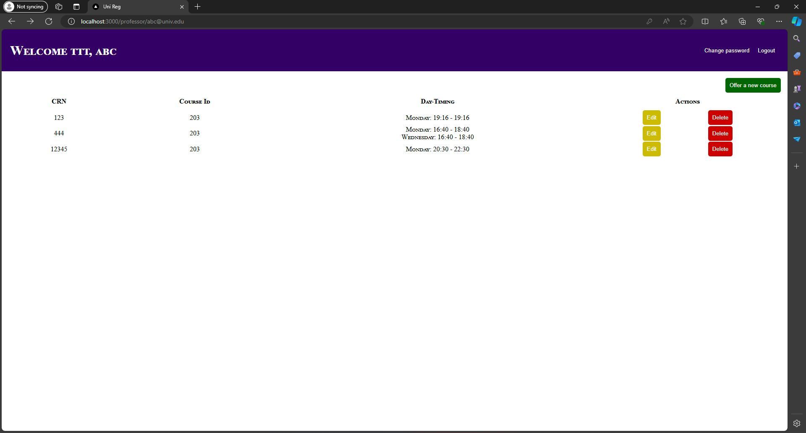
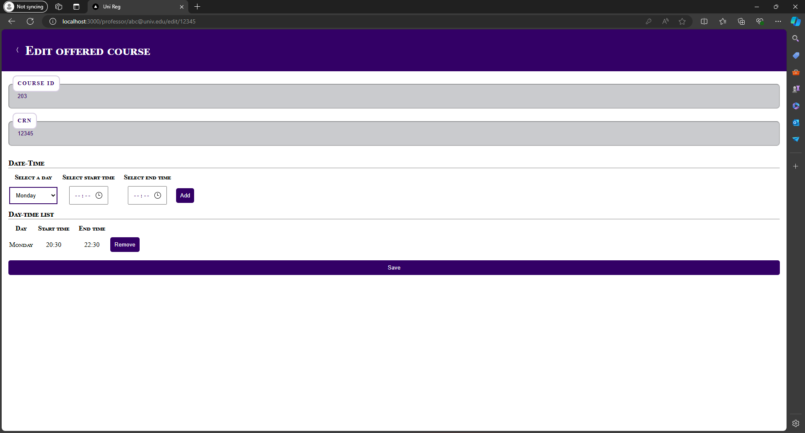

<h1>Course Registration System</h1>
<p>This repo is frontend application for the course-registration-system implemented using Next.js a React framework.</p>

<h3>How it works</h3>
<hr>


This would be the very first screen where all users would login using their email-id and password.
Based on their user-type they would be routed to respective homepages.
Unauthorized access to pages would revert back to login page.

<b>User types:</b>
<ul>
  <li>Admin</li>
  <li>Professor</li>
  <li>Student</li>
</ul>

<h3>Admin</h3>
<hr>

This would be the home page if the logged in user is an admin.

Admin would have the ability to perform CRUD operation on 
<ul>
  <li>Courses</li>
  <li>Professor profiles</li>
  <li>Student profiles</li>
</ul>
with some exceptions like:
<ul>
  <li>Cannot delete courses if they are being offered</li>
  <li>Cannot delete delete professor profile if they are offering a course</li>
  <li>Cannot delete student profile if they are registered for atleast one course</li>
</ul>

<h3>Courses:</h3>

This pages would display list of all courses that are created. Clicking on <i>Add course</i> would navigate to below page.

Where admins can create new courses with respective data. All fields are mandatory. Duplicate course_ids are not allowed. Invalid/ empty fields are notified like below:


Upon successful creation the new course would be displayed on course page


Created course can then be edited by clicking on respective <i>Edit</i> button which would navigate to edit page.

All fields except course_id can be updated with valid values


Successful update would go back to course page displaying the updated course


Similar to edit, courses can be deleted by clicking onr respective <i>Delete</i> button which would then ask for confirmation for the same.

Successful deletion would display updated list of courses. <i><b>Note:</b> Courses that are offered by a professor cannot be deleted.</i>


<h3>Professor:</h3>

This pages would display list of all professor profiles that were created. Clicking on <i>Add professor</i> would navigate to below page.

Where admins can create new professor profiles with respective data. All fields are mandatory. Duplicate email_ids are not allowed.

Upon successful creation the new professor profile would be displayed.


Created professor profiles can then be edited by clicking on respective <i>Edit</i> button which would navigate to edit page.

All fields except email_id can be updated with valid values. <br>
Successful update would go back to professor page displaying the updated professor profile data


Similar to edit, professor profiles can be deleted by clicking onr respective <i>Delete</i> button which would then ask for confirmation for the same.

Successful deletion would display updated list of professor profiles.
<i><b>Note:</b> Professors who are offering a course cannot be deleted.</i>


<h3>Student:</h3>

This pages would display list of all student profiles that were created. Clicking on <i>Add student</i> would navigate to below page.

Where admins can create new student profiles with respective data. All fields are mandatory. Duplicate email_ids are not allowed.

Upon successful creation the new student profile would be displayed.


Created student profiles can then be edited by clicking on respective <i>Edit</i> button which would navigate to edit page.

All fields except email_id can be updated with valid values. <br>
Successful update would go back to professor page displaying the updated professor profile data


Similar to edit, student profiles can be deleted by clicking onr respective <i>Delete</i> button which would then ask for confirmation for the same.

Successful deletion would display updated list of student profiles.
<i><b>Note:</b></i> Students who are registered for a course cannot be deleted.


<hr>
<h3>Professor</h3>

This will be the landing page for professors displaying list of offered courses the logged in professor has offered.
On clicking on <i>Offer a new course</i> will navigate to the following page:

Displaying list of courses available for offering.
On clicking on <i>Offer</i> will display UI for adding more information regarding offering course.

Professors can add day, start and end times.

Professors are not allowed to add duplicate days.


After successfully offering a course a notification would be displayed and home page would display the newly offered courses.



Offered courses can be edited by clicking on respective <i>Edit</i> button.


While editing offered_course only day and timing can be changed.

After successful update the home page would display the updated infomration.


Offered courses can be deleted if they are not registered by any students


<hr>

<h3>Student</h3>
This will be the landing page for students displaying list of registered courses for the logged in student.


Clicking on <i>Browse courses</i> would navigate to a page displaying list of all offered courses on the left and registered courses on the right.

A student cannot register for a course more than once. Doing so would result in an error.


After successful registration the home page displays the updated list of registered courses.


Students can withdraw from the registered courses either by clicking on <i>Widhtraw</i> button in the home page

or they an navigate to browse courses page and remove registered courses and save.


Home page then displays the updated list of registered courses.


<hr>
<h1>Running the application</h1>

This is a [Next.js](https://nextjs.org/) project bootstrapped with [`create-next-app`](https://github.com/vercel/next.js/tree/canary/packages/create-next-app).

## Getting Started

First, run the development server:

```bash
npm run dev
# or
yarn dev
# or
pnpm dev
# or
bun dev
```

Open [http://localhost:3000](http://localhost:3000) with your browser to see the result.

You can start editing the page by modifying `app/page.js`. The page auto-updates as you edit the file.

This project uses [`next/font`](https://nextjs.org/docs/basic-features/font-optimization) to automatically optimize and load Inter, a custom Google Font.

## Learn More

To learn more about Next.js, take a look at the following resources:

- [Next.js Documentation](https://nextjs.org/docs) - learn about Next.js features and API.
- [Learn Next.js](https://nextjs.org/learn) - an interactive Next.js tutorial.

You can check out [the Next.js GitHub repository](https://github.com/vercel/next.js/) - your feedback and contributions are welcome!

## Deploy on Vercel

The easiest way to deploy your Next.js app is to use the [Vercel Platform](https://vercel.com/new?utm_medium=default-template&filter=next.js&utm_source=create-next-app&utm_campaign=create-next-app-readme) from the creators of Next.js.

Check out our [Next.js deployment documentation](https://nextjs.org/docs/deployment) for more details.
